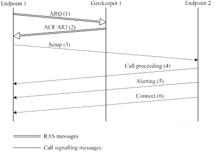
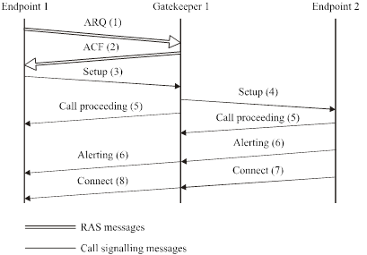
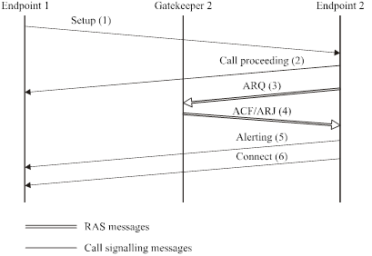
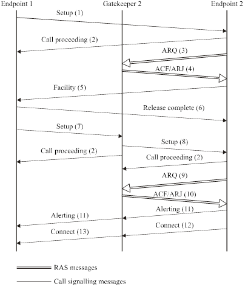
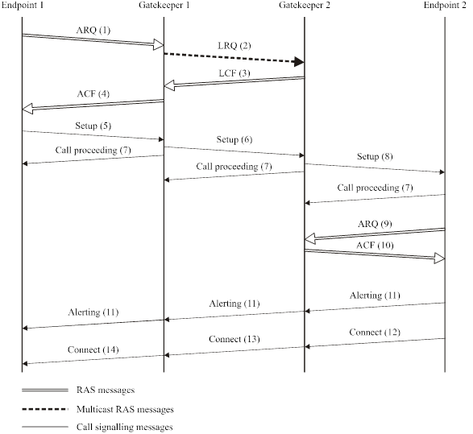
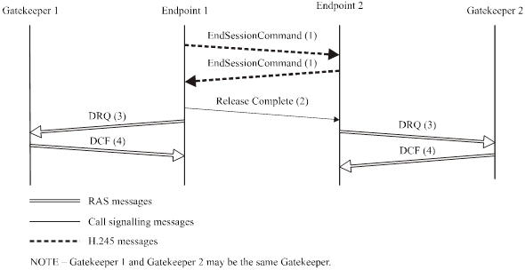
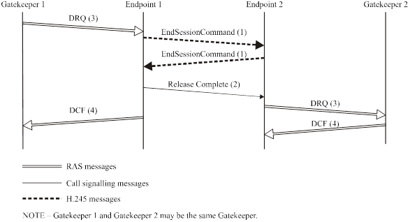



# 1. Overview

H.323 is the international standard for multimedia communication over packet-switched networks, including LANs, WANs, and the Internet. It was first defined by the ITU in 1996 and has been updated regularly. The most recent version is H.323 version 7 (2009).

H.323 is an "umbrella" specification, which includes the standards H.323, H.225.0, H.245, the H.450-series documents, and the H.460-series. It allows for the use of T.120 for data collaboration and file transfer. When referring to the system and set of documents, people generally refer to "H.323", though not every document is mandatory as part of a standard H.323 system. For example, H.460.2, which describes number portability, is generally not used in enterprise videoconferencing systems.

The scope of H.323 covers real-time voice, video, and data communication over packet-switched networks. It was designd from the outset to operate over IP networks, primarily, though H.323 may also operate over other packet-switched networks. It was designed with multipoint voice and video conferencing capabilities, though most users do not take advantage of the multipoint capabilities specified in the protocol.

H.323 was the world market leader for transporting voice and video around the world, with literally billions of minutes of voice traffic every month alone.

***

# 2. System description

The elements of the H.323 components are Terminals, Gateways, Gatekeepers and MCUs. These components communicate through the transmission of Information Streams. An H.323 terminal, Gateway, or MCU can be referred to as an "endpoint", which can call and be called, generates and/or terminates information streams.

## 2.1 Terminal

Used for real-time bidirectional multimedia communications, an H.323 terminal can either be a personal computer or a stand-alone device running an H.323 and multimedia applications,such as telephones, video phones, IVR devices, voicemail systems, and soft phones.

An example of an H.323 terminal is shown as follows. The diagram shows the user equipment interfaces, video codec, audio codec, telematic equipment, H.225.0 layer, system control functions and the interface to the packet-based network. All H.323 terminals shall have a System Control Unit, H.225.0 layer, Network Interface and an Audio Codec Unit. The Video Codec Unit and User Data Applications are optional.

## 2.2 Gateway

The Gateway is composed of a “Media Gateway Controller” (MGC) and a “Media Gateway” (MG), which may co-exist or exist separately. The MGC handles call signaling and other non-media-related functions, while the MG handles the media.

The Gateway shall provide the appropriate translation between transmission formats (for example H.225.0 to/from H.221) and between communications procedures (for example H.245 to/from H.242). In general, the purpose of the Gateway (when not operating as an MCU) is to reflect the characteristics of a network endpoint to an SCN endpoint, and the reverse, in a transparent fashion.

An H.323 endpoint may communicate with another H.323 endpoint on the same network directly and without involving a Gateway. The Gateway may be omitted if communications with SCN terminals (terminals not on the network) are not required. It may also be possible for a terminal on one segment of the network to call out through one Gateway and back onto the network through another Gateway in order to bypass a router or a low bandwidth link.

Gateway may initially operate as a terminal, but later using H.245 signalling begin to operate as an MCU for the same call that was initially point-to-point. Gatekeepers are aware of which terminals are Gateways since this is indicated when the terminal/Gateway registers with the Gatekeeper.

Four examples of an H.323 Gateway are shown as follows. The diagrams show the H.323 terminal or MCU function, the SCN terminal or MCU function, and the conversion function.

## 2.3 Gatekeeper

The Gatekeeper, which is optional in an H.323 system, provides call control services to the H.323 endpoints. More than one Gatekeeper may be present and communicate with each other in an unspecified fashion.

There is one and only one Gatekeeper in a Zone at any given time, although multiple distinct devices may provide the Gatekeeper function in a Zone. Multiple devices that provide the RAS signalling function for the Gatekeeper are referred to as Alternate Gatekeepers. Each Alternate Gatekeeper may appear to endpoints as a distinct Gatekeeper. Communication between Alternate Gatekeepers and other devices that provide the Gatekeeper function for the Zone is outside the scope of this Recommendation.

When it is present in a system, the Gatekeeper shall provide the following services:

* **Address Translation** – The Gatekeeper shall perform alias address to Transport Address translation.

* **Admissions Control** – The Gatekeeper shall authorize network access using ARQ/ACF/ARJ H.225.0 messages. This may be based on call authorization, bandwidth, or some other criteria which is left to the manufacturer. It may also be a null function which admits all requests.

* **Bandwidth Control** – The Gatekeeper shall support BRQ/BRJ/BCF messages. This may be based on bandwidth management. It may also be a null function which accepts all requests for bandwidth changes.

* **Zone Management** – The Gatekeeper shall provide the above functions for terminals, MCUs, and Gateways which have registered with it.

## 2.4 Multipoint control unit

The MCU is an endpoint which provides support for multipoint conferences. The MCU shall consist of an MC and zero or more MPs.

### 2.4.1 Multipoint controller

The MC provides control functions to support conferences between three or more endpoints in a multipoint conference. The MC carries out the capabilities exchange with each endpoint in a multipoint conference. The MC sends a capability set to the endpoints in the conference indicating the operating modes in which they may transmit. The MC may revise the capability set that it sends to the terminals as a result of terminals joining or leaving the conference or for other reasons.

### 2.4.2 Multipoint processor

The MP receives audio, video and/or data streams from the endpoints involved in a centralized or hybrid multipoint conference. The MP processes these media streams and returns them to the endpoints.

***
# 3. Call signalling procedures

## 3.1 Call setup

### 3.1.1 Basic call setup – neither endpoint registered

Endpoint 1 (calling endpoint) sends the Setup (1) message to the well-known Call Signalling Channel TSAP Identifier of Endpoint 2. Endpoint 2 responds with the Connect (4) message which contains an H.245 Control Channel Transport Address for use in H.245 signalling.

### 3.1.2 Both endpoints registered to the same gatekeeper

#### 3.1.2.1 The Gatekeeper has chosen direct call signalling

Endpoint 1 (calling endpoint) initiates the ARQ (1)/ACF (2) exchange with that Gatekeeper. The Gatekeeper shall return the Call Signalling Channel Transport Address of Endpoint 2 (called endpoint) in the ACF. Endpoint 1 then sends the Setup (3) message to Endpoint 2 using that Transport Address. If Endpoint 2 wishes to accept the call, it initiates an ARQ (5)/ACF (6) exchange with the Gatekeeper. It is possible that an ARJ (6) is received by Endpoint 2, in which case it sends Release Complete to Endpoint 1. Endpoint 2 responds with the Connect (8) message which contains an H.245 Control Channel Transport Address for use in H.245 signalling.

#### 3.1.2.2 The Gatekeeper has chosen to route the call signalling

Endpoint 1 (calling endpoint) initiates the ARQ (1)/ACF (2) exchange with that Gatekeeper. The Gatekeeper shall return a Call Signalling Channel Transport Address of itself in the ACF. Endpoint 1 then sends the Setup (3) message using that Transport Address. The Gatekeeper then sends the Setup (4) message to Endpoint 2. If Endpoint 2 wishes to accept the call, it initiates an ARQ (6)/ACF (7) exchange with the Gatekeeper. It is possible that an ARJ (7) is received by Endpoint 2, in which case it sends Release Complete to the Gatekeeper. Endpoint 2 responds with the Connect (9) message which contains an H.245 Control Channel Transport Address for use in H.245 signalling. The Gatekeeper sends the Connect (10) message to Endpoint 1 which may contain the Endpoint 2 H.245 Control Channel Transport Address or a Gatekeeper H.245 Control Channel Transport Address, based on whether the Gatekeeper chooses to route the H.245 Control Channel or not.

### 3.1.3 Only calling endpoint has gatekeeper

#### 3.1.3.1 The Gatekeeper has chosen direct call signalling

Endpoint 1 initiates the ARQ (1)/ACF (2) exchange with the Gatekeeper. Endpoint 1 then sends the Setup (3) message to Endpoint 2 using the well-known Call Signalling Channel Transport Address. If Endpoint 2 wishes to accept the call, it responds with the Connect (6) message which contains an H.245 Control Channel Transport Address for use in H.245 signalling.

#### 3.1.3.2 The Gatekeeper has chosen to route the call signalling

Endpoint 1 (calling endpoint) initiates the ARQ (1)/ACF (2) exchange with that Gatekeeper. The Gatekeeper shall return a Call Signalling Channel Transport Address of itself in the ACF (2). Endpoint 1 then sends the Setup (3) message using that Transport Address. The Gatekeeper then sends the Setup (4) message to the well-known Call Signalling Channel Transport Address of Endpoint 2. If Endpoint 2 wishes to accept the call, it responds with the Connect (7) message which contains an H.245 Control Channel Transport Address for use in H.245 signalling. The Gatekeeper sends the Connect (8) message to Endpoint 1 which may contain the Endpoint 2 H.245 Control Channel Transport Address or a Gatekeeper H.245 Control Channel Transport Address, based on whether the Gatekeeper chooses to route the H.245 Control Channel or not.

### 3.1.4 Only called endpoint has gatekeeper

#### 3.1.4.1 The Gatekeeper has chosen direct call signalling

Endpoint 1 sends the Setup (1) message to Endpoint 2 using the well known Call Signalling Channel Transport Address. If Endpoint 2 wishes to accept the call, it initiates an ARQ (3)/ACF (4) exchange with the Gatekeeper. It is possible that an ARJ (4) is received by Endpoint 2, in which case it sends Release Complete to Endpoint 1. Endpoint 2 responds with the Connect (6) message which contains an H.245 Control Channel Transport Address for use in H.245 signalling.

#### 3.1.4.2 The Gatekeeper has chosen to route the call signalling

Endpoint 1 (calling endpoint) sends a Setup (1) message to the well-known Call Signalling Channel Transport Address of Endpoint 2. If Endpoint 2 wishes to accept the call, it initiates the ARQ (3)/ACF (4) exchange with that Gatekeeper. If acceptable, the Gatekeeper shall return a Call Signalling Channel Transport Address of itself in the ARJ (4) with a cause code of routeCallToGatekeeper. Endpoint 2 replies to Endpoint 1 with a Facility (5) message containing the Call Signalling Transport Address of its Gatekeeper. Endpoint 1 then sends the Release Complete (6) message to Endpoint 2. Endpoint 1 sends a Setup (7) message to the Gatekeeper's Call Signalling Channel Transport Address. The Gatekeeper sends the Setup (8) message to Endpoint 2. Endpoint 2 initiates the ARQ (9)/ACF (10) exchange with that Gatekeeper. Endpoint 2 then responds with the Connect (12) message which contains its H.245 Control Channel Transport Address for use in H.245 signalling. The Gatekeeper sends the Connect (13) message to Endpoint 1 which may contain the Endpoint 2 H.245 Control Channel Transport Address or a Gatekeeper H.245 Control Channel Transport Address, based on whether the Gatekeeper chooses to route the H.245 Control Channel or not.

### 3.1.5 Both endpoints registered to different gatekeepers

#### 3.1.5.1 Both Gatekeepers choose direct call signalling

Endpoint 1 (calling endpoint) initiates the ARQ (1)/ACF (2) exchange with Gatekeeper 1. Gatekeeper 1 may return the Call Signalling Channel Transport Address of Endpoint 2 (called endpoint) in the ACF if Gatekeeper 1 has a method of communicating with Gatekeeper 2. Endpoint 1 then sends the Setup (3) message to either the Transport Address returned by the Gatekeeper (if available) or to the well-known Call Signalling Channel Transport Address of Endpoint 2. If Endpoint 2 wishes to accept the call, it initiates an ARQ (5)/ACF (6) exchange with Gatekeeper 2. It is possible that an ARJ (6) is received by Endpoint 2, in which case it sends Release Complete to Endpoint 1. Endpoint 2 responds with the Connect (8) message which contains an H.245 Control Channel Transport Address for use in H.245 signalling.

#### 3.1.5.2 The calling endpoint's Gatekeeper chooses direct call signalling, and the called endpoint's Gatekeeper chooses to route the call signalling

Endpoint 1 (calling endpoint) initiates the ARQ (1)/ACF (2) exchange with Gatekeeper 1. Gatekeeper 1 may return the Call Signalling Channel Transport Address of Endpoint 2 (called endpoint) in the ACF (2) if Gatekeeper 1 has a method of communicating with Gatekeeper 2. Endpoint 1 then sends the Setup (3) message to either the Transport Address returned by the Gatekeeper (if available) or to the well-known Call Signalling Channel Transport Address of Endpoint 2. If Endpoint 2 wishes to accept the call, it initiates the ARQ (5)/ACF (6) exchange with Gatekeeper 2. If acceptable, Gatekeeper 2 shall return a Call Signalling Channel Transport Address of itself in the ARJ (6) with a cause code of routeCallToGatekeeper. Endpoint 2 replies to Endpoint 1 with a Facility (7) message containing the Call Signalling Transport Address of Gatekeeper 2. Endpoint 1 then sends the Release Complete (8) message to Endpoint 2. Endpoint 1 shall send a DRQ (9) to Gatekeeper 1 which responds with DCF (10). Endpoint 1 then initiates a new ARQ (11)/ACF (12) exchange with Gatekeeper 1. Endpoint 1 sends a Setup (13) message to the Gatekeeper's Call Signalling Channel Transport Address. Gatekeeper 2 sends the Setup (14) message to Endpoint 2. Endpoint 2 initiates the ARQ (15)/ACF (16) exchange with Gatekeeper 2. Endpoint 2 then responds with the Connect (18) message which contains its H.245 Control Channel Transport Address for use in H.245 signalling. Gatekeeper 2 sends the Connect (19) message to Endpoint 1 which may contain the Endpoint 2 H.245 Control Channel Transport Address or a Gatekeeper 2 H.245 Control Channel Transport Address, based on whether the Gatekeeper chooses to route the H.245 Control Channel or not.

#### 3.1.5.3 The calling endpoint's Gatekeeper chooses to route the call signalling, and the called endpoint's Gatekeeper chooses direct call signalling

Endpoint 1 (calling endpoint) initiates the ARQ (1)/ACF (2) exchange with Gatekeeper 1. Gatekeeper 1 shall return a Call Signalling Channel Transport Address of itself in the ACF (2). Endpoint 1 then sends the Setup (3) message using that Transport Address. Gatekeeper 1 then sends the Setup (4) message containing its Call Signalling Channel Transport Address to the well-known Call Signalling Channel Transport Address of Endpoint 2. If Endpoint 2 wishes to accept the call, it initiates the ARQ (6)/ACF (7) exchange with Gatekeeper 2. It is possible that an ARJ (7) is received by Endpoint 2, in which case it sends Release Complete to Endpoint 1. Endpoint 2 responds to Gatekeeper 1 with the Connect (9) message which contains its H.245 Control Channel Transport Address for use in H.245 signalling. Gatekeeper 1 sends the Connect (10) message to Endpoint 1 which may contain the Endpoint 2 H.245 Control Channel Transport Address or a Gatekeeper 1 H.245 Control Channel Transport Address, based on whether the Gatekeeper chooses to route the H.245 Control Channel or not.

#### 3.1.5.4 Both Gatekeepers choose to route the call signalling

Endpoint 1 (calling endpoint) initiates the ARQ (1)/ACF (2) exchange with Gatekeeper 1. Gatekeeper 1 shall return a Call Signalling Channel Transport Address of itself in the ACF (2). Endpoint 1 then sends the Setup (3) message using that Transport Address. Gatekeeper 1 then sends the Setup (4) message to the well-known Call Signalling Channel Transport Address of Endpoint 2. If Endpoint 2 wishes to accept the call, it initiates the ARQ (6)/ACF (7) exchange with Gatekeeper 2. If acceptable, Gatekeeper 2 shall return a Call Signalling Channel Transport Address of itself in the ARJ (7) with a cause code of routeCallToGatekeeper. Endpoint 2 replies to Gatekeeper 1 with a Facility (8) message containing the Call Signalling Transport Address of Gatekeeper 2. Gatekeeper 1 then sends the Release Complete (9) message to Endpoint 2. Gatekeeper 1 sends a Setup (10) message to Gatekeeper 2's Call Signalling Channel Transport Address. Gatekeeper 2 sends the Setup (11) message to Endpoint 2. Endpoint 2 initiates the ARQ (12)/ACF (13) exchange with Gatekeeper 2. Endpoint 2 then responds to Gatekeeper 2 with the Connect (15) message which contains its H.245 Control Channel Transport Address for use in H.245 signalling. Gatekeeper 2 sends the Connect (16) message to Gatekeeper 1 which may contain the Endpoint 2 H.245 Control Channel Transport Address or a Gatekeeper 2 H.245 Control Channel Transport Address, based on whether the Gatekeeper 2 chooses to route the H.245 Control Channel or not. Gatekeeper 1 sends the Connect (17) message to Endpoint 1 which may contain the H.245 Control Channel Transport Address sent by Gatekeeper 2 or a Gatekeeper 1 H.245 Control Channel Transport Address, based on whether the Gatekeeper 1 chooses to route the H.245 Control Channel or not.

### 3.1.6 Optional called endpoint signalling

The procedures defined in 3.1.4 and 3.1.5 assume that the calling endpoint or calling endpoint's Gatekeeper only knows the called endpoints Call Signalling Channel Transport Address. This address may have been received in an LCF sent in response to an LRQ requesting the address of the called endpoint or it may be known through out-of-band methods.If the called endpoint's Gatekeeper desires a Gatekeeper routed call model, it may return its own Call Signalling Transport Address in the LCF. This will allow the calling endpoint or calling endpoints Gatekeeper to send the Setup message directly to the called endpoints Gatekeeper, thus eliminating the redirection process.

Endpoint 1 (calling endpoint) sends an ARQ (1) to Gatekeeper 1. Gatekeeper 1 multicasts an LRQ (2) to locate called Endpoint 2. Gatekeeper 2 returns an LCF (3) with the Call Signalling Channel Transport Address of itself. Thus, Gatekeeper 1 will subsequently send a Setup (6) message to Gatekeeper 2's Call Signalling Channel Transport Address and Gatekeeper 2 will send a Setup (8) message to Endpoint 2. Endpoint 2 initiates the ARQ (9)/ACF (10) exchange with Gatekeeper 2. Endpoint 2 then responds to Gatekeeper 2 with the Connect (12) message which contains its H.245 Control Channel Transport Address for use in H.245 signalling. Gatekeeper 2 sends the Connect (13) message to Gatekeeper 1 which may contain the Endpoint 2 H.245 Control Channel Transport Address or a Gatekeeper 2 H.245 Control Channel Transport Address, based on whether the Gatekeeper 2 chooses to route the H.245 Control Channel or not. Gatekeeper 1 sends the Connect (14) message to Endpoint 1 which may contain the H.245 Control Channel Transport Address sent by Gatekeeper 2 or a Gatekeeper 1 H.245 Control Channel Transport Address, based on whether the Gatekeeper 1 chooses to route the H.245 Control Channel or not.

### 3.1.7 Fast connect procedure

H.323 endpoints may establish media channels in a call using either the procedures defined in ITU T Rec. H.245 or the "Fast Connect" procedure described in this clause. The Fast Connect procedure allows the endpoints to establish a basic point-to-point call with as few as one round-trip message exchange, enabling immediate media stream delivery upon call connection.

The calling endpoint initiates the Fast Connect procedure by sending a Setup message containing the fastStart element to the called endpoint. The fastStart element consists of a sequence of OpenLogicalChannel structures describing media channels which the calling endpoint proposes to send and receive, including all of the parameters necessary to immediately open and begin transferring media on the channels.

### 3.1.8 Call setup via gateways

When an external terminal calls a network endpoint via the Gateway, call setup between the Gateway and the network endpoint proceeds the same as the endpoint-to-endpoint call setup.

#### 3.1.8.1 Gateway in-bound call setup

In this scenario, the Gateway may need to issue a Call Proceeding message to the external terminal while establishing the call on the network.

A Gateway which cannot directly route an incoming SCN call to an H.323 endpoint shall be able to accept two-stage dialling.
For Gateways to H.320 networks (also H.321, H.322 and H.310 in H.321 mode), the Gateway shall accept SBE numbers from the H.320 terminal. Optionally, Gateways to H.320 networks may support the TCS-4 and IIS BAS codes to retrieve the H.323 dialling information after a H.320 call has been established.
For Gateways to H.310 native mode and H.324 networks, the Gateway shall accept H.245 **userInputIndication** messages from the H.324 terminal. In these two cases, support of DTMF (Dual-Tone MultiFrequency) is optional.
For Gateways to speech only terminals, the Gateway shall accept DTMF numbers from the speech-only terminal. These numbers will indicate a second stage dialling number to access the individual endpoint on the network.

#### 3.1.8.2 Gateway out-bound call setup

In this scenario, the Gateway will receive the destination **dialledDigits** or **partyNumber** (**e164Number** or **privateNumber**) in the Setup message. It will then use this address to place the out-bound call. The Gateway may return Call Proceeding messages to the network endpoint while establishing the outgoing call.

### 3.1.9 Call setup with an MCU

For Centralized Multipoint Conferences, all endpoints exchange call signalling with the MCU. Call setup between an endpoint and the MCU proceeds the same as the endpoint-to-endpoint call setup scenarios of 3.1.1 through 3.1.5. The MCU may be the called endpoint or the calling endpoint.

In a Centralized Multipoint Conference, the H.245 Control Channel is opened between the endpoints and the MC within the MCU. The audio, video, and data channels are opened between the endpoints and the MP within the MCU. In a Decentralized Multipoint Conference, the H.245 Control Channel is open between the endpoint and the MC (there may be many such H.245 Control Channels, one for each call). The Audio and Video Channels should be multicast to all endpoints in the conference. The Data Channel shall be opened with the Data MP.

### 3.1.10 Call forwarding

An endpoint wishing to forward a call to another endpoint may issue a Facility message indicating the address of the new endpoint. The endpoint receiving this Facility indication should send a Release Complete and then restart the call setup procedures with the new endpoint.

### 3.1.11 Broadcast call setup

Call setup for loosely controlled Broadcast and Broadcast Panel conferences shall follow the procedures defined in ITU T Rec. H.332.

### 3.1.12 Overlapped sending

H.323 entities can optionally support overlap sending.

### 3.1.13 Call setup to conference alias

Alias addresses may be used to represent a conference at an MC.

### 3.1.14 Gatekeeper modification of destination addresses

An endpoint shall set the **canMapAlias** field to TRUE to indicate its ability to accept modified destination information from a Gatekeeper. The endpoint shall use the destination information returned in ACF or LCF instead of the destination information passed in the ARQ or LRQ. For an ingress Gateway, the destination information that appears in the ACF will be used in the Setup message that is sent on the packet network. For an egress Gateway, the destination information that appears in the ACF will be used to address a destination in the GSTN (for example, appearing in the Setup message sent to the ISDN).

In Gatekeeper-routed cases, the Gatekeeper may modify destination addresses in the Setup message it receives before sending out a corresponding Setup message.

NOTE – H.323 systems prior to Version 4 were not required to set the **canMapAlias** field to TRUE.

### 3.1.15 Indicating desired protocols

When an endpoint places a call, it may indicate in various H.225.0 messages those protocols it desires to utilize during the course of a call, such as fax, H.320, T.120, etc., in the **desiredProtocols** field. If the endpoint provides a list of desired protocols to its Gatekeeper or if an entity sends an LRQ message to a Gatekeeper with a list of desired protocols, the Gatekeeper should attempt to locate an endpoint that can provide support for the desired protocols. If the Gatekeeper finds no endpoint that supports any of the desired protocols, the Gatekeeper shall still resolve the address so that the call may continue.

The calling endpoint may examine the **EndpointType** of the destination endpoint to determine exactly what protocols the remote endpoint possesses.

### 3.1.16 Gatekeeper requested tones and announcements

A Gatekeeper may request a Gateway to play a tone or an announcement for a variety of call events. These call events could be "pre-call" events (something that happens before the terminating gateway is signalled, such as prompting the caller for a destination number or an account code), "mid-call" events (something that happens in the middle of a call, such as providing an announcement to alert the parties on the call that the call will end in a few minutes), or "end-call" events (something that happens at the end of the call, such as a farewell message). In all cases, the Gatekeeper may use a **H248SignalsDescriptor** to describe the prompt the gateway should use.

## 3.2 Initial communication and capability exchange

Once both sides have exchanged call setup messages in 3.1, the endpoints shall, if they plan to use H.245, establish the H.245 Control Channel. The procedures of ITU T Rec. H.245 are used over the H.245 Control Channel for the capability exchange and to open the media channels.

NOTE – Optionally, the H.245 Control Channel may be set up by the called endpoint on receipt of Setup and by the calling endpoint on receipt of Alerting or Call Proceeding. In the event that Connect does not arrive or an endpoint sends Release Complete, the H.245 Control Channel shall be closed.

In order to conserve resources, synchronize call signalling and control, and reduce call setup time, it may be desirable to convey H.245 messages within the H.225.0 call signalling Call Signalling Channel instead of establishing a separate H.245 channel. This process, known as "encapsulation" or "tunnelling" of H.245 messages, is accomplished by utilizing the **h245Control** element of **h323-uu-pdu** on the Call Signalling Channel, copying an encoded H.245 message as an octet string.

## 3.3 Establishment of audiovisual communication

Following the exchange of capabilities and master-slave determination, the procedures of ITU T Rec. H.245 shall then be used to open logical channels for the various information streams. The audio and video streams, which are transmitted in the logical channels setup in H.245, are transported over dynamic TSAP Identifiers using an unreliable protocol (see ITU T Rec. H.225.0). Data communications which is transmitted in the logical channels setup in H.245, are transported using a reliable protocol (see ITU T Rec. H.225.0).

The **openLogicalChannelAck** message returns, or the **reverseLogicalChannelParameters** of the **openLogicalChannel** request contains, the Transport Address that the receiving endpoint has assigned to that logical channel. The transmitting channel shall send the information stream associated with the logical channel to that Transport Address.

Following the opening of logical channels for audio and video, one **h2250MaximumSkewIndication** message shall be sent by the transmitter for each associated audio and video pair.

In unicast, the endpoint shall open logical channels to the MCU or other endpoint. Addresses are passed in the **openLogicalChannel** and __openLogicalChannelAck__.

In multi-unicast, the endpoint must open logical channels to each of the other endpoints. The **openLogicalChannel** is sent to the MC and shall contain the terminal number of the endpoint for which the channel is intended. The endpoint can match an **openLogicalChannelAck** by the **forwardLogicalChannelNumber**.

The H.245 **communicationModeCommand** is sent by an H.323 MC to specify the communication mode for each media type: unicast or multicast. This command may cause a switch between a centralized and decentralized conference and therefore may involve closing all existing logical channels and opening new ones. The **communicationModeCommand** specifies all the sessions in the conference. For each session, the following data are specified: the RTP session identifier, the associated RTP session ID if applicable, a terminal label if applicable, a description of the session, the dataType of the sessions (e.g., G.711), and a unicast or multicast address for the media and media control channels as appropriate for the conference configuration and type.

## 3.4 Call services

### 3.4.1 Bandwidth changes

Call bandwidth is initially established and approved by the Gatekeeper during the admissions exchange. At any time during a conference, the endpoints or Gatekeeper may request an increase or decrease in the call bandwidth.

### 3.4.2 Status

In order for the Gatekeeper to determine if an endpoint is turned off or has otherwise entered a failure mode, the Gatekeeper may use the Information Request (IRQ)/Information Request Response (IRR) message sequence (see ITU T Rec. H.225.0) to poll the endpoints at an interval decided by the manufacturer.

### 3.4.3 Ad hoc conference expansion

This is optional for terminals and Gateways and mandatory for MCs.

### 3.4.4 Supplementary services

Support for Supplementary Services is optional.

### 3.4.5 Multipoint cascading

In order to cascade MCs, a call must be established between the entities containing the MCs.

### 3.4.6 Third party initiated pause and re-routing

For the purpose of this clause, an empty capability set is defined as a **terminalCapabilitySet** message that contains only a sequence number and a protocol identifier.

## 3.5  Call termination

Either endpoint or an intermediate call signalling entity may terminate a call. Call termination shall be accomplished by either Procedure A or Procedure B:

* _Procedure A_:

  1. It should discontinue transmission of video at the end of a complete picture, when applicable.

  2. It should discontinue transmission of data, when applicable.

  3. It should discontinue transmission of audio, when applicable.

  4. It shall transmit a Release Complete message and close the H.225.0 call signalling channel and, if open separately, the H.245 Control Channel without sending any H.245 message. Note that closing the media channels is implied.

  5. Endpoints shall clear the call by using the procedures defined in 8.5.1 or 8.5.2.

* _Procedure B_:

  1. It should discontinue transmission of video at the end of a complete picture and then close all logical channels for video, when applicable.

  2. It should discontinue transmission of data and then close all logical channels for data, when applicable.

  3. It should discontinue transmission of audio and then close all logical channels for audio, when applicable.

  4. It shall transmit the H.245 **endSessionCommand** message in the H.245 Control Channel, indicating to the far end that it wishes to disconnect the call and then discontinue H.245 message transmission.

  5. It shall then wait to receive the **endSessionCommand** message from the other endpoint and then shall close the H.245 Control Channel.

  6. It shall transmit a Release Complete message and close the H.225.0 call signalling channel.

  7. Endpoints shall clear the call by using the procedures defined in 3.5.1 or 3.5.2.

An endpoint receiving **endSessionCommand** without first having transmitted it shall carry out steps B-1 to B-7 above, except that in step B-5, it shall not wait for the **endSessionCommand** from the first endpoint.

Terminating a call may not terminate a conference; a conference may be explicitly terminated using an H.245 message (**dropConference**). In this case, the endpoints shall wait for the MC to terminate the calls as described above.

### 3.5.1 Call clearing without a gatekeeper

In networks that do not contain a Gatekeeper, after steps A-1 to A-5 or B-1 to B-6 above, the call is terminated. No further action is required.

### 3.5.2 Call clearing with a gatekeeper

In networks that contain a Gatekeeper, the Gatekeeper needs to know about the release of bandwidth. After performing steps A-1 to A-5 or B-1 to B-6 above, each endpoint shall transmit an H.225.0 Disengage Request (DRQ) message (3) to its Gatekeeper. The Gatekeeper shall respond with a Disengage Confirm (DCF) message (4). After sending the DRQ message, the endpoints shall not send further unsolicited IRR messages to the Gatekeeper. At this point, the call is terminated. The DRQ and DCF messages shall be sent on the RAS Channel.

Figure above shows the direct call model; a similar procedure is followed for the Gatekeeper-routed model.

### 3.5.3 Call clearing by gatekeeper

The Gatekeeper may terminate call by sending a DRQ to an endpoint. The endpoint shall immediately follow steps A-1 through A-5 or B-1 through B-6 from above and then reply to the Gatekeeper with DCF. The other endpoint, upon receiving endSessionCommand, shall follow the procedure described above.

Figure below shows the direct call model; a similar procedure is followed for the Gatekeeper-routed model.

If the conference is a multipoint conference, the Gatekeeper should send a DRQ to each endpoint in the conference, in order to close the entire conference.

## 3.6 Protocol failure handling

The underlying reliable protocol of the H.225.0 Call Signalling Channel and H.245 Control Channel uses appropriate effort to deliver and receive data on the channel before reporting a protocol failure.

In the event of a failure reported from the underlying reliable transport layer, H.323 entities shall operate in accordance with the text in this clause. If Annex R has been successfully negotiated between two entities, the entity(s) detecting a failure should attempt to recover the call in accordance with the procedures described in Annex R.

***
Abbreviations | Interpretations
--------------|---------------
4CIF|4 times CIF
16CIF|16 times CIF
ABNF|Augmented Backus-Naur Form
ABR|Available Bit Rate
ABT/DT|ATM Block Transfer/Delayed Transmission
ABT/IT|ATM Block Transfer/Immediate Transmission
ACF|Admission Confirmation
AGW|Access Gateway
APE|Application Protocol Entity
ARJ|Admission Reject
ARQ|Admission Request
ATC|ATM Transfer Capability
ATM|Asynchronous Transfer Mode
BAS|Bit rate Allocation Signal
BCF|Bandwidth Change Confirmation
BCH|Bose, Chaudhuri, and Hocquengham
B-HLI|Broadband High Layer Information
B-ISDN|Broadband Integrated Services Digital Network
BRJ|Bandwidth Change Reject
BRQ|Bandwidth Change Request
BTC|Broadband Transfer Capability
CAS|Channel Associated Signalling
CDV|Cell Delay Variation
CED|Called Terminal Identification Tone
CER|Cell Error Ratio
CID|Conference Identifier
CIF|Common Intermediate Format
CLR|Cell Loss Ratio
CMR|Cell Misinsertion Rate
CNG|Calling Tone
CTD|Cell Transfer Delay
DBR|Deterministic Bit Rate
DCF|Disengage Confirmation
DNS|Domain Name System
DRQ|Disengage Request
DSVD|Digital Simultaneous Voice and Data
DTMF|Dual-Tone MultiFrequency
FAS|Facility Associated Signalling
FIR|Full Intra Request
GCC|Generic Conference Control
GCF|Gatekeeper Confirmation
GID|Global Call Identifier
GIT|Generic Identifier Transport
GK|Gatekeeper
GQoS|Guaranteed Quality of Service
GRJ|Gatekeeper Reject
GRQ|Gatekeeper Request
GSTN|General Switched Telephone Network
GW|Gateway
HDLC|High Level Data Link Control
HTTP|Hypertext Transfer Protocol
IACK|Information Acknowledgment
IANA|Internet Assigned Numbers Authority
ID|Identifier
IE|Information Element
IMT|Inter-machine Trunk
INAK|Information Negative Acknowledgment
IP|Internet Protocol
IPX|Internetwork Protocol Exchange
IRQ|Information Request
IRR|Information Request Response
ISDN|Integrated Services Digital Network
ISUP|ISDN User Part
ITU-T|International Telecommunication Union – Telecommunication Standardization Sector
LAN|Local Area Network
LCF|Location Confirmation
LRJ|Location Reject
LRQ|Location Request
MC|Multipoint Controller
MCS|Multipoint Communications System
MCU|Multipoint Control Unit
MG|Media Gateway
MGC|Media Gateway Controller
MIME|Multipurpose Internet Mail Extensions
MP|Multipoint Processor
MTU|Maximum Transmission Unit
NACK|Negative Acknowledge
NFAS|Non-facility Associated Signalling
N-ISDN|Narrow-band Integrated Services Digital Network
NNI|Network-to-Network Interface
NSAP|Network Service Access Point
OLC|H.245 openLogicalChannel message
PBN|Packet-Based Network
PDU|Packet Data Unit
PPP|Point-to-Point Protocol
PRI|Primary Rate Interface
QCIF|Quarter CIF
QoS|Quality of Service
QSIG|Signalling between the Q reference points defined in [44]
RAS|Registration, Admission and Status
RAST|Receive and Send Terminal
RCF|Registration Confirmation
RIP|Request in Progress
RRJ|Registration Reject
RRQ|Registration Request
RTCP|Real Time Control Protocol
RTP|Real Time Protocol
SBE|Single Byte Extension
SBR1|Statistical Bit Rate configuration 1
SBR2|Statistical Bit Rate configuration 2
SBR3|Statistical Bit Rate configuration 3
SCI|Service Control Indication
SCM|Selected Communications Mode
SCN|Switched Circuit Network
SCR|Service Control Response
SDL|Specification and Description Language
SECBR|Severely Errored Cell Block Ratio
SPX|Sequential Protocol Exchange
SQCIF|Sub QCIF
SS7|Signalling System No. 7
SSRC|Synchronization Source Identifier
TCP|Transport Control Protocol
TGW|Trunking Gateway
TSAP|Transport layer Service Access Point
UCF|Unregister Confirmation
UDP|User Datagram Protocol
UDPTL|Facsimile UDP Transport Layer (protocol)
UNI|User-to-Network Interface
URJ|Unregister Reject
URQ|Unregister Request
VC|Virtual Channel
